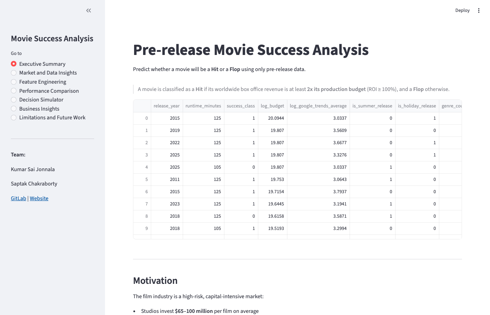
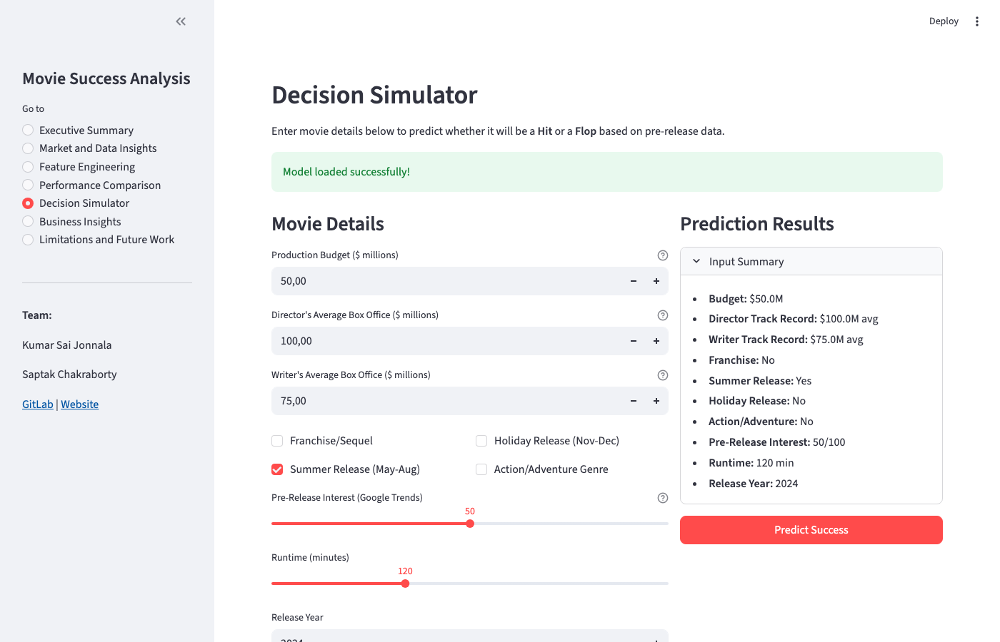
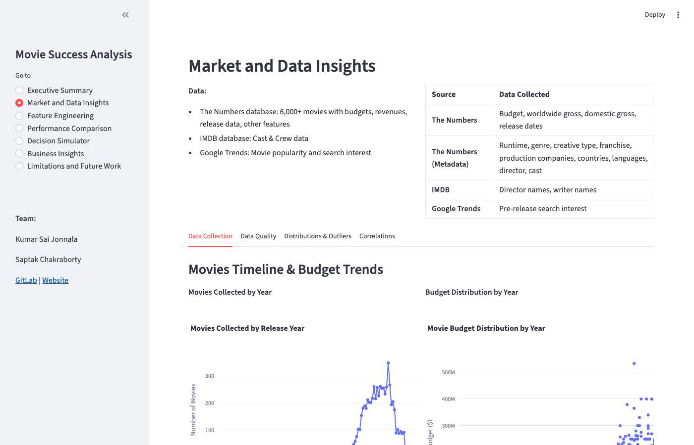
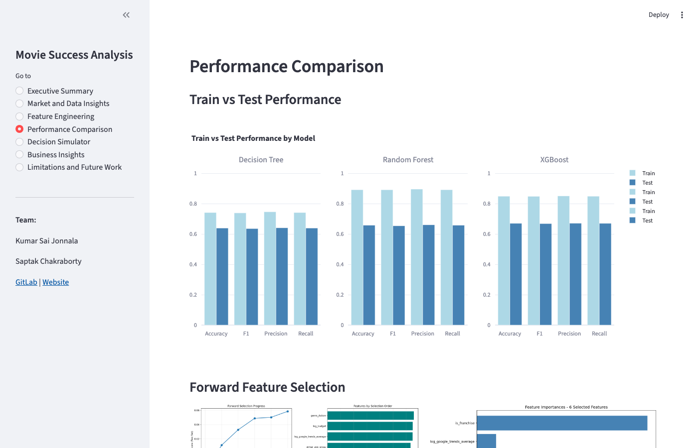
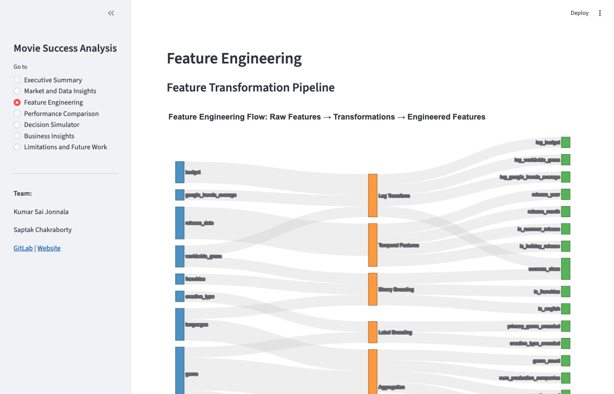
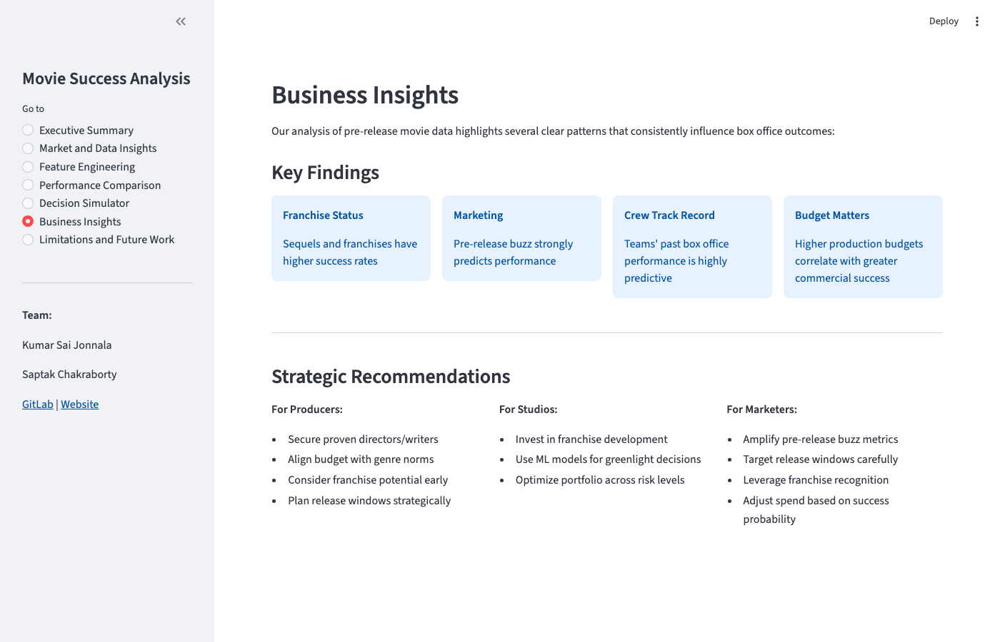

# Movie Success Analysis

**Predicting box office Hit vs. Flop using Machine Learning — before a movie is released.**

[](https://www.python.org/)
[](https://streamlit.io/)
[](https://xgboost.readthedocs.io/)
[](https://mlflow.org/)
[](LICENSE)

**Live App:** [movie-success-ai-analysis.streamlit.app](https://movie-success-ai-analysis.streamlit.app/)

---

## Demo

| Executive Summary | Decision Simulator |
|---|---|
|  |  |

| Market & Data Insights | Performance Comparison |
|---|---|
|  |  |

| Feature Engineering | Business Insights |
|---|---|
|  |  |

---

## Overview

The film industry is a high-risk, capital-intensive market where studios invest $65–100M per film on average, yet only ~40% of theatrical releases are profitable. This project builds an end-to-end machine learning pipeline to predict whether a movie will be a **Hit** or a **Flop** using only pre-release information — helping studios make data-driven greenlighting decisions before spending a dollar on production.

**Hit definition:** worldwide gross ≥ 2× production budget (ROI ≥ 100%)

---

## Key Results

| Model | Accuracy | F1 Score | Precision | Recall |
|---|---|---|---|---|
| Decision Tree | 63.9% | 63.6% | 64.1% | 63.9% |
| Random Forest | 65.8% | 65.4% | 66.1% | 65.8% |
| **XGBoost** | **67.0%** | **66.9%** | **67.1%** | **67.0%** |
| XGBoost (Tuned) | 66.3% | 65.9% | 66.5% | 66.3% |

**Best model: XGBoost** with 67% accuracy and 66.9% F1 on held-out test data.

### Top Predictive Features

| Feature | Importance |
|---|---|
| Franchise / Sequel status | 64.98% |
| Pre-release Google Trends interest | 8.91% |
| Release year | 6.96% |
| Action / Adventure genre | 6.49% |
| Writer's average box office | 6.43% |
| Log production budget | 6.22% |

---

## Features

- **End-to-end ML pipeline** — data collection through hyperparameter-tuned model deployment
- **Multi-source data collection** — web scraping The Numbers, IMDB, and Google Trends
- **30+ engineered features** — temporal, content, production, and crew credibility features
- **4 ML models compared** — Decision Tree, Random Forest, XGBoost, tuned XGBoost
- **Experiment tracking** — all runs logged with MLflow
- **Interactive Streamlit app** with 7 pages including a live Decision Simulator
- **36 visualizations** — interactive Plotly charts and static Matplotlib/Seaborn plots

---

## Tech Stack

| Category | Tools |
|---|---|
| Data Collection | BeautifulSoup, requests, pytrends |
| Data Processing | pandas, numpy, scipy |
| Visualization | Plotly, Matplotlib, Seaborn, missingno |
| Machine Learning | scikit-learn, XGBoost |
| Experiment Tracking | MLflow |
| Web App | Streamlit |
| Model Persistence | joblib |

---

## Project Structure

```
movie-success-analysis/
├── data/
│   ├── raw/                          # Raw scraped data
│   └── processed/                    # Cleaned datasets
├── notebook/
│   └── Movie_success_analysis.ipynb  # Full end-to-end pipeline
├── data_collection/
│   ├── fetch_movie_budgets.py        # Scraper for budgets & revenue
│   ├── fetch_movies_metadata.py      # Scraper for movie metadata
│   ├── get_google_trends.py          # Google Trends API
│   └── get_reviews_imdb.py           # IMDB reviews scraper
├── artifacts/
│   ├── best_model.joblib             # Trained XGBoost model
│   ├── feature_importance.csv
│   ├── model_metrics.csv
│   ├── selected_features.csv
│   ├── movies_final.csv
│   └── visualizations/              # 36 chart outputs
├── frontend/
│   └── app.py                        # Streamlit web app
├── docs/
│   └── screenshots/                  # App screenshots
├── reports/
│   └── MovieSuccessAnalysis.pptx
├── requirements.txt
└── README.md
```

---

## Setup & Installation

### Prerequisites (macOS)
```bash
brew install libomp    # Required for XGBoost on macOS
```

### Install dependencies
```bash
# Clone the repo
git clone https://github.com/YOUR_USERNAME/movie-success-analysis.git
cd movie-success-analysis

# Create and activate virtual environment
python3 -m venv .venv
source .venv/bin/activate      # macOS/Linux
# .venv\Scripts\activate       # Windows

# Install Python packages
pip install -r requirements.txt
```

---

## Usage

### Live Demo
Try the deployed app at **[movie-success-ai-analysis.streamlit.app](https://movie-success-ai-analysis.streamlit.app/)**

### Run Locally
```bash
source .venv/bin/activate
cd frontend
streamlit run app.py
```
Opens at **http://localhost:8501**

### Run the Full Notebook Pipeline
```bash
source .venv/bin/activate
jupyter notebook notebook/Movie_success_analysis.ipynb
```
Use **Kernel → Restart & Run All** to execute all cells. This regenerates all model artifacts and visualizations.

### Re-collect Data (optional)
```bash
python data_collection/fetch_movie_budgets.py
python data_collection/fetch_movies_metadata.py
```

---

## Pipeline

```
Data Collection  →  Wrangling & EDA  →  Feature Engineering
      ↓                   ↓                      ↓
 Web scraping        Missing values          Log transforms
 The Numbers         Outlier treatment       Temporal features
 IMDB                Target labeling         Crew credibility
 Google Trends                               Encoding
                                                 ↓
                         Model Training & Comparison
                                                 ↓
                    Decision Tree → Random Forest → XGBoost
                                                 ↓
                           Hyperparameter Tuning
                                                 ↓
                       RandomizedSearchCV + GridSearchCV
                                                 ↓
                           Streamlit Dashboard
```

---

## App Pages

| Page | Description |
|---|---|
| Executive Summary | Project overview and processed dataset |
| Market & Data Insights | Timeline, budgets, completeness, correlations |
| Feature Engineering | Sankey diagram of the feature pipeline |
| Performance Comparison | ROC curves, learning curves, feature importances |
| Decision Simulator | Enter movie details → get Hit/Flop prediction |
| Business Insights | Key findings and strategic recommendations |
| Limitations & Future Work | Scope and next steps |

---

## Contributors

- **Saptak Chakraborty**

---

## License

This project is licensed under the [MIT License](LICENSE).
